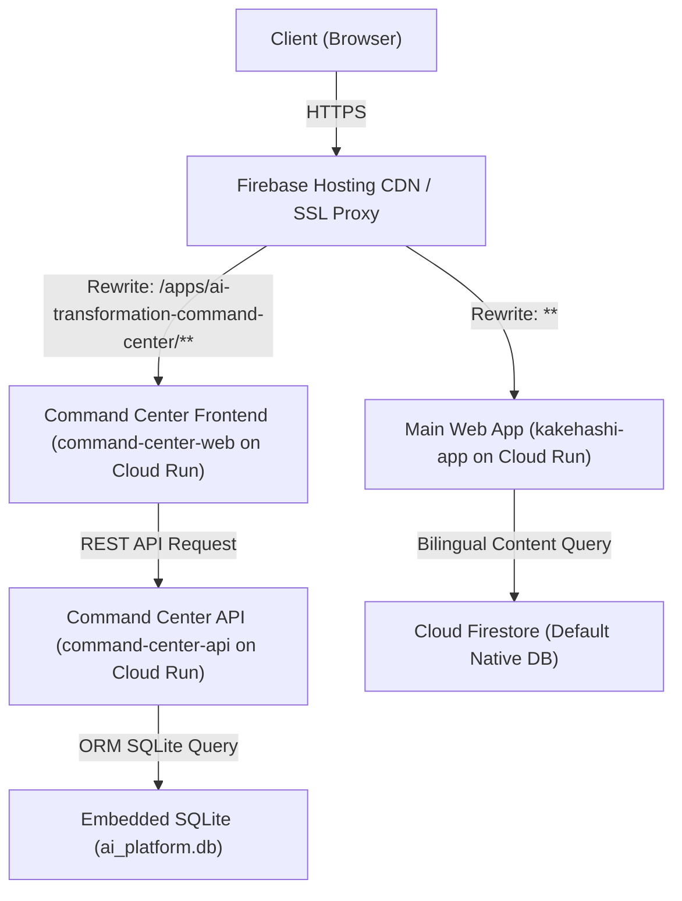

# Project Kakehashi — Architect Onboarding Guide

Welcome to **Project Kakehashi**. This document serves as a comprehensive onboarding guide for incoming software architects. It outlines the platform's overarching architecture, design systems, and deployment workflows, with a specific focus on the recently integrated and deployed **AI Transformation Command Center**.

---

## 1. System Overview & Core Philosophy

Project Kakehashi is a highly optimized, bilingual portfolio platform and enterprise AI showcase website. Its architecture is built around three core pillars:

1. **Unified Modern Shell**: A Next.js App Router application (`apps/web` or `kakehashi-app`) serving as the central container for personal portfolio pages, blogs, frameworks, and app catalogue entry points.
2. **Cost-to-Zero Model**: To keep hosting costs at zero when idle, every component utilizes scale-to-zero serverless solutions. This means Cloud Run is configured with a minimum instance count of `0`, and the database layer leverages Firebase/Firestore (NoSQL/native) or embedded, zero-cost SQLite databases.
3. **Bilingual Routing & SEO**: Full support for English (`en`) and Japanese (`ja`) locales, coordinated via Next.js middleware, global CDN redirects, and Alternate-Hreflang header tags.



---

## 2. Component Directory Structure

The repository is organized as a monorepo containing:

- **`apps/web/`**: The primary Next.js (App Router) client shell.
- **`rajagobalan-site-main/apps/enterprise-ai-platform/`**: The legacy AI Transformation Command Center.
  - **`backend/`**: A FastAPI backend application (Python) containing domain logic for ROI simulation, maturity assessment, architecture layout blueprints, and Wardley mapping.
  - **`frontend/`**: A Next.js (Pages Router) application providing the Command Center dashboard.
  - **`database/`**: Contains database schema definitions and initializers.
- **`infra/terraform/`**: Infrastructure-as-code files managing GCP IAM, Cloud Run services, and Firestore collections.

---

## 3. Database Architecture & Seeding Strategy

To align with the **cost-to-zero** requirement and avoid the persistent base charge of Cloud SQL PostgreSQL instances, the Command Center utilizes an **embedded SQLite database** (`ai_platform.db`):

- **Data Lifetime**: The SQLite database file is pre-populated with default demo data during the container image build phase. It is stored inside the container at `/app/ai_platform.db`.
- **Session State**: Because Cloud Run instances are ephemeral and scale to zero, any changes made to the database by users (e.g. creating new projects or assessments) are isolated to the active container session and do not persist across scale-to-zero events. This is acceptable since it acts as a showcase demo.
- **ORM Integrity**: The backend FastAPI app uses SQLAlchemy as its ORM. Database tables are generated dynamically at startup via `Base.metadata.create_all` using python models as the single source of truth, rather than relying on raw SQL scripts.

---

## 4. Local Development Lifecycle

To run the full stack locally for development or review:

1. **Docker Compose**:
   Navigate to `rajagobalan-site-main/apps/enterprise-ai-platform` and run:
   ```bash
   docker compose up -d
   ```
2. **Ports Allocation**:
   - **PostgreSQL**: Port `5432` (optional, for local testing with Postgres if configured)
   - **Backend API**: Port `8000` (FastAPI Swagger UI available at `http://localhost:8000/docs`)
   - **Frontend App**: Port `3005` (remapped from `3000` to avoid conflicts with the main portfolio dev server)
3. **Database Seeding**:
   To seed the database with test assets, execute:
   ```bash
   docker compose exec backend python seed_db.py
   ```

---

## 5. Deployment Pipeline

The application is deployed to Google Cloud Platform (`rajagobalan-site` project) using Cloud Run and Firebase Hosting.

### Step 0: Deploy Kakehashi Shell
The main Kakehashi shell is built from the repository root `Dockerfile`. Use the Dockerfile path, not Cloud Run source-buildpack deployment, so the Next.js standalone runtime, static assets, public assets, and bundled `content/` tree land in the same image.

```bash
IMAGE="us-central1-docker.pkg.dev/rajagobalan-site/cloud-run-source-deploy/kakehashi-app:<tag>"
gcloud builds submit --project rajagobalan-site --tag "$IMAGE" .
gcloud run deploy kakehashi-app \
  --image "$IMAGE" \
  --project rajagobalan-site \
  --region us-central1 \
  --platform managed \
  --allow-unauthenticated \
  --service-account kakehashi-app-sa@rajagobalan-site.iam.gserviceaccount.com \
  --update-env-vars FIREBASE_PROJECT_ID=rajagobalan-site,KAKEHASHI_CONTENT_DIR=/app/content
```

Production pages read from Firestore when `FIREBASE_PROJECT_ID` is set. After deploying content changes, run the ingest endpoint from the new revision:

```bash
curl https://kakehashi-app-537634522206.us-central1.run.app/api/ingest
```

The expected active-wave ingest shape is `Processed 9 entities`. If it reports duplicate entities, inspect the standalone image for a nested `content/content` directory before treating the deployment as clean.

### Step 1: Deploy Backend API
1. Build and push the backend container to GCP Container Registry using Cloud Build (this bundles the pre-seeded SQLite database file):
   ```bash
   cd backend
   gcloud builds submit --tag gcr.io/rajagobalan-site/command-center-api .
   ```
2. Deploy to Cloud Run:
   ```bash
   gcloud run deploy command-center-api \
     --image gcr.io/rajagobalan-site/command-center-api:latest \
     --platform managed \
     --region us-central1 \
     --allow-unauthenticated \
     --update-env-vars '^|^DATABASE_URL=sqlite:///ai_platform.db|CORS_ORIGINS=https://www.rajagobalan.com,https://rajagobalan.com,https://rajagobalan-site.web.app,https://rajagobalan-site.firebaseapp.com,https://command-center-web-olazdd633a-uc.a.run.app,https://command-center-web-537634522206.us-central1.run.app,http://localhost:3000,http://localhost:3005,http://localhost:8000'
   ```
3. Copy the returned URL (e.g. `https://command-center-api-537634522206.us-central1.run.app`). The Command Center frontend calls this backend directly from the browser, so the production frontend origins must be present in `CORS_ORIGINS`.

### Step 2: Deploy Frontend Web
1. Configure `basePath` in `frontend/next.config.js` to ensure Next.js resolves assets and routing links correctly under a sub-path:
   ```javascript
   basePath: '/apps/ai-transformation-command-center',
   ```
2. Build the frontend container using a temporary `cloudbuild.yaml` file to inject the API URL at build time:
   ```bash
   cd frontend
   gcloud builds submit --config cloudbuild.yaml .
   ```
3. Deploy to Cloud Run:
   ```bash
   gcloud run deploy command-center-web \
     --image gcr.io/rajagobalan-site/command-center-web:latest \
     --platform managed \
     --region us-central1 \
     --allow-unauthenticated \
     --update-env-vars NEXT_PUBLIC_API_URL=<YOUR_BACKEND_API_URL>
   ```

### Step 3: Configure Routing and Redirection
To route traffic cleanly from the primary domain, configure rewrites and redirects in `firebase.json` before deploying:

- **Rewrites (Proxy to Cloud Run)**:
  Rewrites must be placed before the main catch-all rewrite to route sub-paths correctly:
  ```json
  "rewrites": [
    {
      "source": "/apps/ai-transformation-command-center",
      "run": { "serviceId": "command-center-web", "region": "us-central1" }
    },
    {
      "source": "/apps/ai-transformation-command-center/**",
      "run": { "serviceId": "command-center-web", "region": "us-central1" }
    }
  ]
  ```
- **Localized Entry Pages**:
  Do not add locale-prefixed rewrites for `/en/apps/ai-transformation-command-center` or `/ja/apps/ai-transformation-command-center`. Those routes belong to the Kakehashi shell and provide localized entry and deployment-note pages. Only `/apps/ai-transformation-command-center` and nested runtime paths are proxied to `command-center-web`.
- **Runtime Contract**:
  Keep the deployment contract and smoke commands aligned with `docs/command-center-runtime-contract.md`.
- **Deploy Configuration**:
  ```bash
  npx -y firebase-tools@latest deploy --only hosting:main
  ```

---

## 6. Key Design & UX Standards

- **Visual Theme**: High-quality glassmorphism panels, dark mode/curated HSL gradient tailwinds, subtle hover transitions, and clean typography (Inter / Outfit).
- **Responsive Layout**: Fluid layouts capable of fitting standard desktop views as well as mobile breakpoints.
- **Bilingual Interface**: Toggle buttons on the main shell translate layout elements and content seamlessly between English and Japanese.
- **Standalone Integrity**: Sub-applications (like Command Center and Foodie AI) must maintain their original standalone functionality when navigated to directly, but visually fit inside the shell design guidelines.
