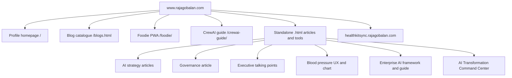
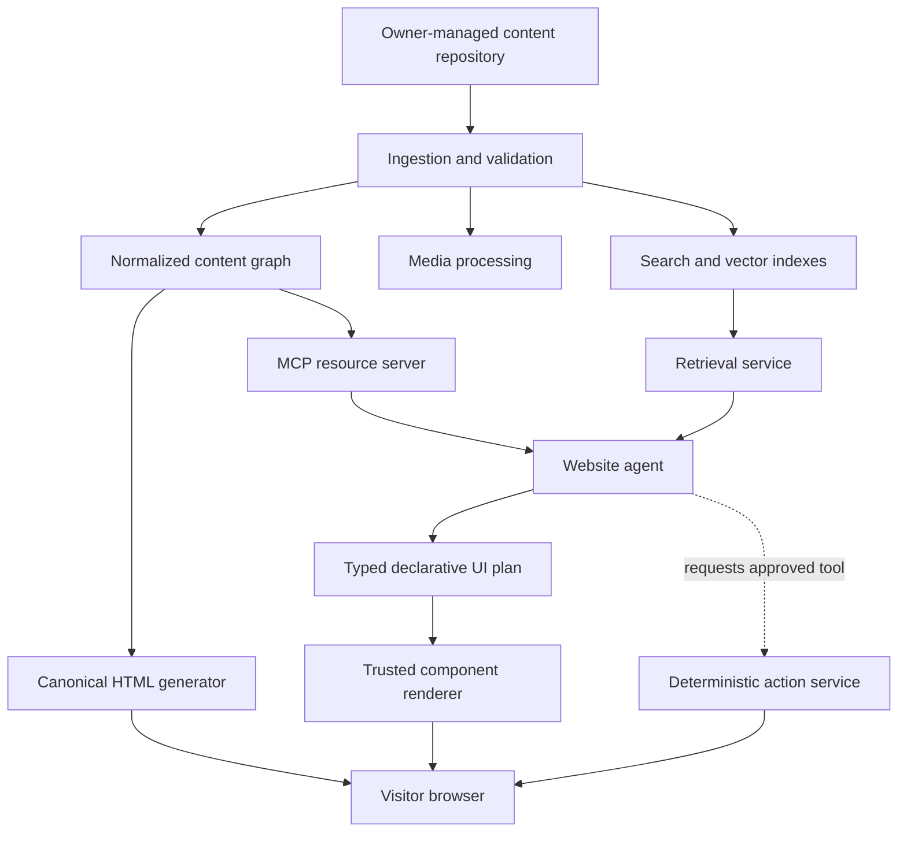

# Project Kakehashi (架け橋)
## Product and System Requirements Specification for the Agentic Bilingual Rajagobalan.com Platform

| Field | Value |
|---|---|
| Document status | Draft v0.1 |
| Date | 24 June 2026 |
| Website | `www.rajagobalan.com` and associated subsites |
| Primary owner | Rajkumar Rajagobalan |
| Initial languages | English (`en`) and Japanese (`ja`) |
| Delivery strategy | Local-first development, phased migration, controlled production cutover |
| First implementation scope | Profile page, followed by the blog catalogue and each blog/application one at a time |

---

## 1. Project name

**Project Kakehashi (架け橋)**

*Kakehashi* means “bridge” in Japanese. The name represents the platform’s purpose:

- a bridge between English and Japanese;
- a bridge between visitors and Rajkumar’s knowledge, experience, projects, media, and applications;
- a bridge between deterministic web technology and generative agent experiences;
- a bridge between structured data and human-readable storytelling;
- a bridge from the current website to an agent-native model of the future web.

**Working product descriptor:**

> **Project Kakehashi — an agentic, bilingual, content-defined personal web platform.**

**Core product principle:**

> **Stable facts. Stable URLs. Generative journeys.**

---

## 2. Executive summary

Project Kakehashi will progressively replace the current `www.rajagobalan.com` website and its related pages, applications, and subsites with a unified bilingual web platform.

The new platform will not require the owner to manually design and code every page. The owner will publish source material—primarily Markdown, photographs, videos, CSV files, Excel files, structured records, and application data—into an organized content repository. An automated ingestion pipeline will validate, normalize, index, and expose the content to the web application and its agents.

Every important subject will have a deterministic, server-rendered or statically generated HTML page with a stable URL. On top of that dependable foundation, an agent will interpret visitor intent and create an appropriate interface by selecting and arranging approved UI components. The agent will generate a **declarative UI plan**, not unrestricted HTML, CSS, JavaScript, or executable code.

For example, a visitor who selects Stanford in the Education section will immediately receive a canonical Stanford page containing verified information. The agent may then enrich that page with an institution overview, a personal photo gallery, a timeline, reflections, related professional experiences, and relevant follow-up paths. The content remains grounded in approved source material; only its composition and presentation may be generative.

The platform will initially support English and Japanese through separate, crawlable URLs. The deterministic content, navigation, metadata, agent responses, retrieval pipeline, and UI components must all support both languages.

Development will occur locally first. Production publishing will begin only after the profile experience, content pipeline, bilingual architecture, security controls, accessibility, automated tests, and migration process meet the agreed acceptance criteria.

---

## 3. Product vision

### 3.1 Vision statement

Create a personal website that demonstrates how the future web can combine trusted data, conventional HTML, composable applications, and AI agents without sacrificing reliability, accessibility, security, search visibility, or human control.

### 3.2 Intended visitor experience

A visitor should be able to:

1. open a fast, complete, accessible page without waiting for an AI model;
2. browse Rajkumar’s profile, education, experience, ventures, publications, frameworks, and applications in English or Japanese;
3. select an entity, topic, image, project, or question to reveal a contextual interface;
4. receive answers and visual compositions grounded in approved content;
5. understand which statements are verified facts, Rajkumar’s own reflections, external context, or agent-generated synthesis;
6. continue using the site when the agent, model provider, or external service is unavailable;
7. perform controlled actions only through explicit, validated, auditable workflows.

### 3.3 Intended owner experience

The owner should be able to:

1. add or update content by placing files in an organized repository;
2. preview all changes locally before publication;
3. see validation errors before content becomes available to the site or agent;
4. manage English and Japanese content as paired versions of the same entity;
5. publish a new article, media collection, or data set without manually constructing a page;
6. approve or reject agent-generated translations, metadata, summaries, and SEO recommendations;
7. migrate the current website incrementally without a high-risk “big bang” release;
8. retain control over facts, permissions, visibility, routes, branding, and write operations.

---

## 4. Business and product objectives

| ID | Objective | Success indicator |
|---|---|---|
| OBJ-01 | Establish a unified content-defined platform | Profile, articles, media, tools, and applications use a common repository, schema, navigation system, and design system |
| OBJ-02 | Demonstrate a credible Software 3.0 web experience | Agent composes contextual UIs from approved components and grounded data at runtime |
| OBJ-03 | Preserve deterministic web strengths | Every public topic has useful HTML, a stable URL, metadata, accessibility semantics, and a non-agent fallback |
| OBJ-04 | Support English and Japanese equally | Locale-specific routes, navigation, metadata, search, retrieval, and agent responses are implemented for both languages |
| OBJ-05 | Make content publication owner-friendly | New content can be introduced through files and validated data rather than page-by-page coding |
| OBJ-06 | Migrate safely | Existing public routes are inventoried, preserved, redirected, or intentionally retired with no unexplained loss of content |
| OBJ-07 | Protect trust and accuracy | Generated content identifies its sources and cannot alter verified credentials, dates, claims, or permissions |
| OBJ-08 | Create a reusable foundation for future apps | MCP resources, controlled tools, component catalogues, and data adapters support future web applications and agents |
| OBJ-09 | Support responsible growth and SEO | Canonical pages remain people-first; an SEO agent may propose changes but cannot publish autonomously |

---

## 5. Scope

### 5.1 In scope

- Complete redesign and reimplementation of the primary profile website.
- English and Japanese experiences.
- Migration of the current blog index and each current article, infographic, guide, interactive tool, PWA, and subsite in controlled waves.
- A content repository based primarily on Markdown and media, with adapters for JSON, CSV, Excel, databases, and other approved data sources.
- Automated content ingestion, validation, media processing, indexing, preview, and build triggers.
- A deterministic HTML experience for all canonical public content.
- An agent layer for retrieval, intent interpretation, contextual explanation, and declarative UI composition.
- A trusted, prebuilt component catalogue.
- An MCP layer exposing approved resources and tools.
- Separation of read-only public capabilities from authenticated read-write capabilities.
- Search, RAG, provenance, citations, caching, observability, analytics, and audit logs.
- SEO, structured metadata, sitemaps, canonical links, redirects, and multilingual discoverability.
- Local development, testing, preview, and migration tooling.
- A future controlled SEO agent with human approval.

### 5.2 Out of scope for the initial release

- Allowing an LLM to generate and execute arbitrary HTML, JavaScript, SQL, shell commands, or server code in production.
- Autonomous publication by an SEO or content agent.
- Public write access to source files, databases, or administrative MCP tools.
- Personalized interfaces based on covert profiling or third-party tracking.
- Replacing verified content with model-generated biography or credentials.
- Migrating every complex application in the first release wave.
- Selecting the final production hosting provider before the local architecture and deployment requirements have been validated.
- Storing identifiable health information in the public profile platform.
- Treating an AI model response as the system of record for transactions or personal data.

### 5.3 Future scope

- Visitor-authorized preferences and saved journeys.
- Meeting requests and other controlled actions.
- Authenticated owner and collaborator workspaces.
- Additional languages.
- Reusable public MCP services for selected published knowledge.
- Agent-to-agent collaboration for editorial, translation, analytics, and SEO workflows.
- Native mobile or desktop clients reusing the same content and UI protocols.

---

## 6. Definitions

| Term | Definition in Project Kakehashi |
|---|---|
| Canonical page | A stable, crawlable, accessible HTML page representing a durable subject or application |
| Content-defined website | A website whose source of truth is structured content and media rather than manually assembled pages |
| Deterministic layer | Routes, verified content, permissions, data validation, transactions, HTML semantics, and components controlled by conventional code |
| Generative layer | Runtime selection, ordering, summarization, explanation, and composition performed by an AI model within strict boundaries |
| Agent | A server-side service that interprets intent, retrieves approved content, selects tools, and returns grounded text or a typed UI plan |
| Declarative UI plan | Structured data describing which approved components to render, with what approved content; it is not executable code |
| Component catalogue | A finite set of reviewed, accessible, branded UI components that the renderer can instantiate |
| RAG | Retrieval-augmented generation: retrieving relevant approved material and supplying it to a model for grounded output |
| MCP | Model Context Protocol: a standard interface through which an agent can access approved resources, prompts, and tools |
| Resource | Read-oriented content or data made available to an MCP client |
| Tool | A schema-defined operation an agent may invoke; tools may read or write depending on authorization |
| Entity | A durable content subject such as a person, institution, role, project, article, application, event, or media item |
| Provenance | The source, author, date, permissions, and transformation history associated with content or a generated statement |
| Ephemeral view | A visitor-specific composition that is not automatically a canonical public page |
| Software 1.0 | Conventional logic written explicitly in code |
| Software 2.0 | Behaviour learned into model weights through training |
| Software 3.0 | Behaviour programmed at runtime through language, context, tools, and agent orchestration |

---

## 7. As-Is state

### 7.1 Evidence classification

The As-Is analysis distinguishes between:

- **Confirmed:** directly visible in the publicly delivered site.
- **Strongly inferred:** supported by URL structure and delivered page behaviour, but not confirmed by repository or hosting access.
- **Unknown:** cannot be determined externally and must be verified during discovery.

### 7.2 Current public topology

The current public website presents:

- a primary one-page profile at `/`;
- a separate blog catalogue at `/blogs.html`;
- standalone `.html` articles and tools;
- directory-based client applications such as `/foodie/` and `/crewai-guide/`;
- a separate HealthKitSync/Innuir subdomain;
- links between these properties through conventional navigation.



### 7.3 Current profile page

**Confirmed observations:**

- The homepage contains About, Experience, Education, Certifications, Expertise, Languages, and Contact content in one delivered HTML document.
- Navigation for About, Experience, and Education uses sections within the homepage rather than durable entity pages.
- The homepage links to the blog catalogue, Foodie, and the HealthKitSync/Innuir subdomain.
- The content is currently English only.

**Strengths:**

- Core profile content is directly available as HTML.
- The page does not depend on an AI model to communicate the owner’s identity and credentials.
- The single-page format is straightforward and fast to navigate.

**Limitations:**

- Stanford, MIT, Capgemini, Nuvear, AAGNAA, and other important entities do not have independent canonical routes.
- Rich personal media and related narratives cannot be progressively assembled around an entity.
- The page is not visibly driven by a structured content model.
- There is no public bilingual route structure.
- There is no visible runtime agent, grounded Q&A, or generative UI layer.

### 7.4 Current blog and application catalogue

The public blog catalogue currently identifies the following content and applications. This is an observed inventory, not a guarantee that every public route has been discovered; a full crawler-based inventory is required before migration.

| Current route or property | Current type | Observed status | Proposed target category |
|---|---|---|---|
| `/blogs.html` | Catalogue page | Public | `/en/insights`, `/ja/insights` |
| `/framework.html` | Interactive framework | Public | `/[locale]/frameworks/enterprise-ai-transformation` |
| `/enterprise-ai-reference-guide.html` | Long-form reference guide | Public | `/[locale]/insights/enterprise-ai-reference-guide` |
| `/singapore-ai-strategy-status.html` | Article | Public | `/[locale]/insights/singapore-ai-strategy` |
| `/singapore-ai-strategy-infographics.html` | Interactive infographic | Public | Child experience of the corresponding article |
| `/responsible-ai-governance-adoption.html` | Article | Public | `/[locale]/insights/responsible-ai-governance` |
| `/responsible-ai-infographic.html` | Interactive infographic | Public | Child experience of the corresponding article |
| `/ai-executive-talking-points.html` | Article | Public | `/[locale]/insights/ai-executive-talking-points` |
| `/ai-talking-points-infographic.html` | Interactive infographic | Public | Child experience of the corresponding article |
| `/blood-pressure-app-design.html` | Research article | Public | `/[locale]/insights/blood-pressure-app-design` |
| `/bp-chart-infographic.html` | Interactive infographic | Public | Child experience of the corresponding article |
| `/bp.html` | Interactive chart/workspace | Public | `/[locale]/labs/blood-pressure-chart` |
| `/ai-transformation-command-center.html` | Interactive platform/demo | Public | `/[locale]/apps/ai-transformation-command-center` |
| `/deployment-guide.html` | Documentation | Public | Documentation route associated with the command centre |
| `/foodie/` | PWA using Gemini | Public | `/[locale]/apps/foodie` |
| `/crewai-guide/` | Searchable developer guide | Public | `/[locale]/guides/crewai` |
| `healthkitsync.rajagobalan.com` | Separate subsite | Public | Decide: retain subdomain, reverse proxy, or migrate to `/[locale]/apps/innuir` |

### 7.5 Current publishing model

**Strongly inferred:**

- The deployed output is predominantly static HTML, CSS, JavaScript, and media.
- Routes use a mixture of explicit `.html` filenames, directories, and a subdomain.
- Individual articles and applications appear to be published as relatively independent units.

**Unknown and requiring discovery:**

- Source repository structure.
- Exact hosting provider.
- Build tooling and package versions.
- Whether deployment is automated through CI/CD or performed manually.
- Asset pipeline and image/video optimization.
- Current analytics, monitoring, error reporting, backup, and rollback mechanisms.
- Current DNS, CDN, certificate, and caching configuration.
- Whether source content already exists separately from the generated HTML.

### 7.6 Current strengths to preserve

- Publicly accessible HTML for major profile and article content.
- Stable current URLs that may already have external links or search history.
- A growing portfolio of articles, frameworks, visualizations, guides, and applications.
- Demonstrated use of AI within individual applications.
- Clear thematic focus on enterprise AI, governance, health technology, and transformation.

### 7.7 Current constraints and gaps

| Area | As-Is condition | Impact |
|---|---|---|
| Information architecture | Profile, articles, apps, and subsites use different route patterns | Fragmented navigation and harder future automation |
| Content management | No externally visible unified content schema | Content reuse, localization, provenance, and automated publication are difficult |
| Internationalization | English-only public experience | Japanese visitors are not served in their preferred language |
| Entity depth | Important profile entities exist only as sections or text | No stable URLs for rich education, experience, institution, or project stories |
| Generative UI | No visible agent-generated component composition | The site does not yet demonstrate the proposed future-web concept |
| Agent grounding | No visible RAG/MCP/citation layer | Visitors cannot explore the owner’s content through a governed agent |
| Design consistency | Pages and apps are independently structured | Inconsistent experience and duplicated patterns are likely |
| SEO governance | Static pages are discoverable, but multilingual and agentic SEO architecture is absent | Future generative views could create duplication or crawlability issues if unmanaged |
| Production hygiene | Foodie exposes a Firebase configuration instruction in its public UI | Internal setup information appears as a user-facing error state |
| Security model | Public read/write agent boundaries are not visible | Agent and MCP capabilities require a new explicit control architecture |
| Migration process | No published phased migration model | A full redesign could create unnecessary cutover risk |

### 7.8 As-Is conclusion

The current site is a useful deterministic foundation and should not be discarded conceptually. Its public content is generally delivered through conventional web pages, which supports reliability and crawlability. The principal problem is fragmentation: content, applications, routes, and presentation are assembled as separate properties rather than generated from a common content and capability platform.

---

## 8. To-Be state

### 8.1 Target operating model

The owner manages **content and data**, not individual page implementations. The platform compiles that material into canonical pages and makes it available to a controlled agent.



### 8.2 Target experience layers

#### Layer A — Deterministic content and control plane

Responsible for:

- stable routes;
- verified profile data;
- published Markdown content;
- media permissions;
- HTML semantics;
- accessibility;
- design tokens;
- component implementation;
- authentication and authorization;
- data validation;
- transactions and writes;
- redirects, canonical tags, and sitemaps;
- source references and audit logs.

#### Layer B — Generative experience plane

Responsible for:

- interpreting the visitor’s stated intent;
- retrieving relevant approved content;
- choosing an appropriate approved interface pattern;
- ordering and grouping components;
- producing grounded summaries and relationships;
- adapting detail and explanation to the selected language and interaction;
- recommending the next relevant path.

#### Layer C — Controlled action plane

Responsible for future operations such as:

- contact submissions;
- meeting requests;
- feedback;
- subscriptions;
- owner-approved publication operations;
- authenticated app-specific actions.

Every action must remain schema-validated, authorized, logged, and reversible where feasible.

### 8.3 Target route model

The target will use explicit locale-prefixed URLs:

```text
/en/
/ja/
/en/education/stanford-executive-program
/ja/education/stanford-executive-program
/en/experience/capgemini-apac
/ja/experience/capgemini-apac
/en/insights/responsible-ai-governance
/ja/insights/responsible-ai-governance
/en/apps/foodie
/ja/apps/foodie
```

Requirements:

- Slugs should normally remain language-invariant to simplify entity mapping and route preservation.
- Each English page must reference its Japanese counterpart and vice versa.
- Existing unprefixed routes must be mapped to new canonical destinations with permanent redirects when appropriate.
- Ephemeral agent compositions must not automatically create indexable URLs.
- A visitor must be able to share a deterministic canonical page independent of session state.

### 8.4 Target profile experience

The profile homepage will provide a complete deterministic overview, while important entities will link to rich canonical pages.

Example:

```text
Education
  ├── Stanford Executive Program
  ├── MIT COO Program
  ├── Anaheim University MBA
  ├── Shizuoka University M.Eng
  ├── Madras Institute of Technology B.Tech
  └── The American College BSc
```

Selecting Stanford will:

1. navigate immediately to the canonical Stanford entity page;
2. display verified institution, programme, date, credential wording, and owner-authored narrative;
3. load approved personal photographs and video;
4. optionally ask the agent to generate a contextual composition;
5. show related experiences only when supported by source content;
6. continue to function if the agent is disabled or unavailable.

### 8.5 Target content lifecycle

```mermaid
sequenceDiagram
    participant O as Owner
    participant R as Content repository
    participant P as Pipeline
    participant V as Validator
    participant I as Index/MCP
    participant W as Web preview

    O->>R: Add or update Markdown, media, CSV, Excel, or records
    R->>P: File event or explicit sync command
    P->>V: Parse and validate schemas, links, permissions, and locales
    alt Validation failure
        V-->>O: Actionable error report; publication blocked
    else Validation success
        V->>P: Normalized entities
        P->>I: Refresh search index, embeddings, and MCP resources
        P->>W: Rebuild affected canonical pages and previews
        W-->>O: Local review and approval
    end
```

---

## 9. How the technology differs from traditional software development

### 9.1 Traditional model

In conventional web development, developers predefine:

- every route;
- every page layout;
- every interaction branch;
- every query and workflow;
- the exact sequence in which content appears;
- how each visitor moves from one screen to another.

Content is then inserted into those predefined structures. A new experience usually requires new templates, code, tests, and deployment work.

### 9.2 Project Kakehashi model

Project Kakehashi retains deterministic routes and components but introduces a runtime agent that can compose them according to context.

Developers predefine:

- schemas;
- design tokens;
- components;
- tool permissions;
- data access rules;
- validation;
- routing;
- fallback states;
- safety boundaries.

The owner supplies:

- verified facts;
- narratives;
- media;
- structured data;
- editorial guidance;
- permissions;
- translations.

The agent decides within those boundaries:

- which approved content is relevant;
- which approved components fit the visitor’s intent;
- the sequence and emphasis of those components;
- how to summarize and connect source material;
- which follow-up path to present.

### 9.3 Software paradigm classification

| Platform element | Paradigm |
|---|---|
| Routes, renderer, security, schemas, tests, actions, and design system | Software 1.0 |
| Language, embedding, vision, and multimodal models | Software 2.0 |
| Runtime interpretation, retrieval, tool selection, and UI composition through instructions and context | Software 3.0 |
| Markdown, media, CSV, Excel, databases, and normalized records | Data/context layer |
| MCP | Capability and integration layer |

Project Kakehashi is therefore not “AI-generated code deployed as a website.” It is a **hybrid system in which conventional software defines the safe operating envelope and an agent composes experiences inside it.**

### 9.4 Key architectural difference

```text
Traditional:
Developer creates page → content is inserted → visitor receives fixed page

Kakehashi:
Owner publishes governed content
    → pipeline creates canonical page and agent-ready resources
    → visitor receives canonical page
    → agent may compose an additional contextual UI using approved components
```

---

## 10. Advantages and disadvantages

### 10.1 Advantages

| Advantage | Value |
|---|---|
| Content rather than pages becomes the source of truth | The same fact, image, article, or project can be reused across pages, languages, search, agents, and applications |
| Faster publication | New material can be published through validated files without manually building a page |
| Contextual journeys | Different visitors can explore education, experience, ventures, or technical work through interfaces appropriate to their intent |
| Progressive enhancement | The site remains useful without the agent, while the agent provides a differentiated experience when available |
| Bilingual reuse | Shared entities and media can support separate English and Japanese narratives without duplicating the entire application |
| Stronger provenance | Every generated statement and component can retain references to the content records that support it |
| Reusable capability layer | MCP resources and tools can serve the website, future applications, editorial agents, and owner workflows |
| Controlled experimentation | New generative UI patterns can be introduced through a component catalogue without allowing arbitrary code generation |
| Better long-term migration | Existing articles and applications can move independently while the platform foundation remains stable |
| Future-web demonstration | The site itself becomes evidence of an agent-and-data web architecture rather than only describing it |

### 10.2 Disadvantages

| Disadvantage | Consequence |
|---|---|
| Greater architectural complexity | The platform requires content engineering, web engineering, retrieval, model orchestration, security, and observability |
| Runtime latency | Agent retrieval and generation are slower than rendering static HTML |
| Variable cost | Model and embedding usage create per-interaction and re-indexing costs |
| Non-deterministic outputs | The same request may produce different summaries or compositions |
| New security surface | Prompt injection, unsafe tools, data leakage, and poisoned content become material risks |
| Harder testing | Testing must cover deterministic code plus model behaviour, evaluation data, and model changes |
| Editorial overhead | English and Japanese versions require governance, review, and terminology management |
| Vendor and model dependency | Provider policy, performance, pricing, or model behaviour can change |
| SEO complexity | Infinite or session-specific pages can create duplication and crawl-control problems |
| Trust risk | Visitors may confuse generated interpretation with verified biography or external fact |
| Accessibility risk | A model can select poor compositions unless the component system and validation enforce accessible patterns |
| Operational burden | Index freshness, cache invalidation, model monitoring, source provenance, and tool logs must be maintained |

---

## 11. Recommended technology architecture

The technology choices below are recommended starting points. Exact versions should be selected and locked during implementation after compatibility tests.

### 11.1 Web application

- **TypeScript** for end-to-end type safety.
- **React with Next.js App Router** for server rendering, static generation, streaming, route layouts, metadata, and progressive enhancement.
- **Server Components by default**; Client Components only for interactive behaviour.
- **CSS design tokens and a controlled component library**. Utility CSS may be used, but brand tokens must not be generated by the agent.
- **MD/MDX parsing through a controlled pipeline** using `remark`/`rehype` or an equivalent maintained toolchain.
- **Zod or JSON Schema** for runtime validation of content, MCP inputs/outputs, and UI plans.

### 11.2 Content and data

- Filesystem-based content repository for Markdown, YAML, JSON, images, video, CSV, and Excel.
- Normalized content records stored locally in **SQLite** during early development.
- A migration path to **PostgreSQL** with full-text and vector capabilities for production scale.
- A content manifest and entity IDs independent of filenames.
- Media processing with maintained image and video libraries such as Sharp and FFmpeg.
- Hybrid retrieval combining metadata filters, lexical search, and vector similarity.

### 11.3 Agent and generative UI

- Server-side agent orchestration behind an internal API.
- Model-provider abstraction so the platform is not coupled to one model.
- Typed structured outputs for all agent operations.
- A declarative UI schema inspired by or compatible with the A2UI approach.
- A client-side renderer that maps allowed component names to locally implemented React components.
- No direct execution of model-generated markup or scripts.
- Streaming may be used to progressively add components after the canonical page is visible.

### 11.4 MCP

- A dedicated MCP server implemented in TypeScript or Python using an official SDK.
- Public profile resources exposed read-only.
- Administrative and write tools isolated behind separate credentials and, preferably, a separate process or server.
- JSON Schema for every tool input and output.
- Explicit tool allowlists per agent role.
- Authentication and authorization outside the model.

### 11.5 Local development

- Git repository with a monorepo or clearly separated packages.
- `pnpm`, `npm`, or another locked package manager; one must be selected and used consistently.
- Docker Compose for local databases and auxiliary services when required.
- Environment modes:

```text
AGENT_MODE=off      # deterministic website only
AGENT_MODE=mock     # deterministic test fixtures
AGENT_MODE=local    # approved local model
AGENT_MODE=remote   # approved hosted provider
```

- Local content watcher.
- Local preview build.
- Local MCP Inspector and integration tests.
- No production publication command enabled by default.

### 11.6 Testing and quality

- Unit and schema tests with Vitest or equivalent.
- End-to-end tests with Playwright.
- Accessibility tests with axe-core plus manual keyboard and screen-reader testing.
- Visual regression tests for approved component variants.
- Agent evaluation suite with fixed prompts, expected source records, and prohibited claims.
- Link, redirect, sitemap, metadata, and locale parity checks.
- Security testing for prompt injection, path traversal, unsafe uploads, XSS, SSRF, authorization bypass, and tool misuse.

### 11.7 Observability

- Structured logs with correlation IDs.
- OpenTelemetry-compatible traces for page, retrieval, model, MCP, and tool operations.
- Metrics for latency, token usage, cache hit rate, retrieval quality, UI-plan validation failures, tool calls, and fallback frequency.
- Separate content audit logs and security audit logs.
- Redaction of secrets and personal data before logs are stored.

---

## 12. Proposed repository structure

```text
kakehashi/
├── apps/
│   ├── web/                         # Main bilingual web application
│   ├── agent/                       # Agent orchestration service
│   └── mcp-server/                  # MCP resources and tools
│
├── packages/
│   ├── content-schema/              # Entity, locale, media, and permission schemas
│   ├── content-pipeline/            # Parsing, validation, normalization, indexing
│   ├── ui-schema/                   # Declarative generative UI contract
│   ├── ui-components/               # Trusted component catalogue
│   ├── retrieval/                   # Search, filters, embeddings, ranking
│   ├── i18n/                        # Locale dictionaries, glossary, formatting
│   ├── security/                    # Policy, authorization, sanitization
│   └── observability/               # Logs, metrics, traces
│
├── content/
│   ├── profile/
│   ├── education/
│   ├── experience/
│   ├── ventures/
│   ├── insights/
│   ├── guides/
│   ├── frameworks/
│   ├── apps/
│   └── media/
│
├── data/
│   ├── csv/
│   ├── excel/
│   ├── json/
│   └── imports/
│
├── migrations/                      # Route and content migration manifests
├── evals/                           # Agent evaluation datasets and expected results
├── tests/
├── docs/
└── docker-compose.yml
```

### 12.1 Entity package example

```text
content/education/stanford-executive-program/
├── entity.yaml
├── en.md
├── ja.md
├── media.yaml
└── assets/
    ├── campus-01.jpg
    ├── cohort-01.jpg
    └── reflection-video.mp4
```

### 12.2 Shared deterministic metadata example

```yaml
id: education.stanford-executive-program
type: education
canonical_slug: stanford-executive-program
institution:
  id: institution.stanford-gsb
  official_name: Stanford University Graduate School of Business
programme:
  official_name: Stanford Executive Program
start_date: 2025-10
end_date: 2026-02
visibility: public
publish_status: published
sensitivity: public
agent_use: allowed
claims_policy:
  may_summarize: true
  may_infer_relationships: true
  may_change_credential_wording: false
ui_capabilities:
  - institution_hero
  - media_gallery
  - timeline
  - reflection_cards
  - related_experience
```

### 12.3 Localized narrative example

```markdown
---
locale: en
title: Stanford Executive Program
summary: A personal account of the Stanford Executive Program experience.
translation_status: source
last_editorial_review: 2026-06-24
seo:
  title: Stanford Executive Program | Rajkumar Rajagobalan
  description: ...
---

## Overview

Owner-authored narrative...
```

The Japanese file will carry equivalent locale-specific title, summary, narrative, and metadata while referencing the same shared entity ID.

---

## 13. Bilingual requirements

### 13.1 Language architecture

| ID | Requirement | Priority |
|---|---|---|
| I18N-001 | All canonical public pages shall have explicit locale-prefixed URLs | Must |
| I18N-002 | English and Japanese pages shall be separate HTML documents, not content swapped only through client-side state | Must |
| I18N-003 | The language switch shall preserve the current entity or route whenever a corresponding translation exists | Must |
| I18N-004 | The selected locale shall determine UI labels, content retrieval, date/number formatting, metadata, and agent response language | Must |
| I18N-005 | The site shall not rely solely on IP address or browser language to choose a page | Must |
| I18N-006 | Browser preference may be used to suggest a language, but the user shall remain in control | Should |
| I18N-007 | Each locale page shall include appropriate `lang`, alternate-language, and canonical metadata | Must |
| I18N-008 | Sitemaps shall include both language variants and their relationships | Must |
| I18N-009 | Missing Japanese content shall use an explicit fallback indicator; it shall not be silently represented as reviewed Japanese content | Must |
| I18N-010 | Japanese machine translations shall require editorial approval before receiving `published` status | Must |
| I18N-011 | A bilingual terminology glossary shall govern names, credentials, company names, AI terminology, and recurring phrases | Must |
| I18N-012 | Search and retrieval shall use language-aware processing and shall prefer same-locale source material | Must |
| I18N-013 | Cross-lingual retrieval may be used only when no adequate same-language source exists and the response identifies the translation/synthesis | Should |
| I18N-014 | Japanese typography, line breaking, punctuation, and responsive layouts shall be tested independently | Must |
| I18N-015 | Media captions, transcripts, and alt text shall support both languages | Must |

### 13.2 Translation workflow

```text
English source created or changed
    ↓
Translation status set to "required"
    ↓
Agent may create a Japanese draft
    ↓
Glossary and protected-name validation
    ↓
Human review
    ↓
Status becomes "approved"
    ↓
Japanese canonical page becomes publishable
```

Supported translation states:

```text
missing → draft_machine → draft_human → review_required → approved → published → stale
```

A change to a shared fact or English narrative must mark affected Japanese content as `stale` until reviewed.

---

## 14. Functional requirements

Priority notation: **Must**, **Should**, **Could**.

### 14.1 Content ingestion and publishing

| ID | Requirement | Priority | Acceptance criterion |
|---|---|---|---|
| FR-001 | The system shall ingest Markdown, YAML, JSON, images, video, CSV, and Excel from designated repository folders | Must | Supported files appear in the local content inventory after sync |
| FR-002 | A file change shall trigger or permit an explicit incremental content pipeline run | Must | Only affected entities, pages, indexes, and caches are rebuilt where possible |
| FR-003 | Every entity shall have a stable unique ID independent of filename or route | Must | Renaming a file does not change entity identity |
| FR-004 | Content shall be validated against versioned schemas before indexing or rendering | Must | Invalid content blocks publication and generates actionable errors |
| FR-005 | Validation shall cover required metadata, dates, route collisions, links, locale status, media permissions, alt text, and source references | Must | Test fixtures demonstrate each failure mode |
| FR-006 | The pipeline shall produce a normalized content graph consumable by the web app, search, RAG, and MCP | Must | All four consumers resolve the same entity ID and revision |
| FR-007 | A local preview shall display pending content before production publication | Must | Owner can review both locales and deterministic/agent-off mode |
| FR-008 | The pipeline shall retain content revision, checksum, source path, author, and last-review information | Must | Each rendered block can be traced to a content revision |
| FR-009 | The owner shall be able to exclude a file, field, or media asset from public display, agent use, or both | Must | Permissions are enforced in rendering and retrieval tests |
| FR-010 | Excel and CSV adapters shall map approved columns into typed records rather than exposing arbitrary workbook content directly | Must | Invalid columns and formulas are rejected or quarantined |

### 14.2 Canonical profile and entity pages

| ID | Requirement | Priority | Acceptance criterion |
|---|---|---|---|
| FR-011 | The homepage shall remain a complete deterministic profile experience | Must | Agent-off mode presents useful About, Experience, Education, Expertise, Languages, and Contact content |
| FR-012 | Major education, experience, venture, and project entities shall have canonical detail routes | Must | Direct URL load works without prior homepage navigation |
| FR-013 | Canonical pages shall render meaningful HTML on the server or at build time | Must | Essential content exists before client JavaScript and agent execution |
| FR-014 | Internal links shall use entity IDs and route resolution rather than hard-coded duplicate paths | Must | Route changes update links centrally |
| FR-015 | Every page shall include a visible language switch and breadcrumb or equivalent location context | Must | Keyboard and screen-reader tests pass |
| FR-016 | Existing profile claims shall be migrated as verified records and reviewed before publication | Must | No credential, date, amount, role, or institution wording changes without owner approval |

### 14.3 Stanford generative UI scenario

| ID | Requirement | Priority | Acceptance criterion |
|---|---|---|---|
| FR-017 | Selecting Stanford shall first navigate to the canonical Stanford entity page | Must | Navigation completes without an agent call |
| FR-018 | The page shall display only Stanford-tagged and publication-approved personal media | Must | Permission and entity filters prevent unrelated media |
| FR-019 | The agent may compose an institution hero, gallery, timeline, reflections, and related experience using approved components | Must | Returned UI plan validates against the component schema |
| FR-020 | The agent shall not imply a degree or credential different from the verified record | Must | Evaluation prompts cannot produce prohibited credential wording |
| FR-021 | The Japanese Stanford page shall use approved Japanese content and labels | Must | Locale parity checklist passes |
| FR-022 | If the agent times out or fails, the deterministic Stanford page shall remain complete and interactive | Must | Failure injection test passes |
| FR-023 | Generated synthesis shall identify its supporting source records | Must | Source panel or expandable provenance is available |

### 14.4 Agent and generative UI

| ID | Requirement | Priority | Acceptance criterion |
|---|---|---|---|
| FR-024 | The agent shall run server-side and shall not expose model-provider credentials to the browser | Must | Browser network inspection contains no provider secret |
| FR-025 | The agent shall receive only content permitted for the current visitor, locale, and operation | Must | Authorization tests cover anonymous and authenticated contexts |
| FR-026 | Agent output shall conform to a versioned JSON schema | Must | Invalid output is rejected and replaced with a deterministic fallback |
| FR-027 | The agent shall select only components present in the approved catalogue | Must | Unknown component names cannot be rendered |
| FR-028 | The agent shall not emit executable JavaScript, CSS, SQL, or shell commands for rendering | Must | Schema has no executable-code field and security tests reject attempts |
| FR-029 | The renderer shall control HTML semantics, styling, interaction, accessibility, and responsive behaviour | Must | All generated compositions use local components |
| FR-030 | The agent shall distinguish verified fact, owner reflection, external context, and generated inference | Must | UI labels or metadata represent content class |
| FR-031 | The agent shall cite retrieved content at block or answer level | Must | Evaluation set verifies source linkage |
| FR-032 | The system shall support agent-off, mock, local-model, and remote-model modes | Must | The same site build operates in each configured mode |
| FR-033 | Popular, non-personal generative compositions may be cached using content revision, locale, intent, and schema version | Should | Cache invalidates when source records change |
| FR-034 | The UI may stream in progressively only after the canonical page shell and essential content are visible | Must | Performance trace confirms render order |
| FR-035 | The visitor shall be informed when a response or composition is AI-generated | Must | Disclosure is visible and accessible |
| FR-036 | The agent shall ask for clarification only when ambiguity materially affects correctness; otherwise it shall provide a grounded default view | Should | Scenario tests cover ambiguous entities |

### 14.5 Search and RAG

| ID | Requirement | Priority | Acceptance criterion |
|---|---|---|---|
| FR-037 | Search shall support title, body, tags, entity type, date, locale, and related-entity retrieval | Must | Search test set returns expected records |
| FR-038 | Retrieval shall combine deterministic metadata filters with lexical and semantic ranking | Must | Private, wrong-locale, or irrelevant content is excluded |
| FR-039 | Search indexes shall be updated incrementally after content validation | Must | New approved content is searchable without a full rebuild |
| FR-040 | Retrieved chunks shall retain entity ID, source path, locale, revision, and section anchors | Must | Agent citations resolve to a canonical page and section |
| FR-041 | The agent shall abstain or state insufficient evidence when approved sources do not support an answer | Must | Evaluation set includes unanswerable questions |
| FR-042 | User prompts and agent-generated text shall not be written into the knowledge base without an explicit governed workflow | Must | No unauthorised memory persists across sessions |

### 14.6 MCP resources and tools

| ID | Requirement | Priority | Acceptance criterion |
|---|---|---|---|
| FR-043 | The MCP server shall expose public profile and publication content as read-only resources | Must | Anonymous client cannot invoke write operations |
| FR-044 | Resource URIs shall use stable entity IDs, such as `profile://education/stanford-executive-program` | Must | Resource resolution survives route changes |
| FR-045 | MCP tools shall be single-purpose and schema-defined | Must | Tool schemas validate all inputs and outputs |
| FR-046 | Read-only and read-write capabilities shall use separate authorization scopes | Must | Tokens with read scope fail all write tests |
| FR-047 | Administrative tools shall require authenticated owner access and explicit confirmation for high-impact actions | Must | Negative and replay tests pass |
| FR-048 | Every tool call shall create an audit event containing actor, purpose, input classification, result, and correlation ID | Must | Audit log is queryable without storing secrets |
| FR-049 | The public website agent shall initially receive only a read-only MCP toolset | Must | Initial release configuration contains no write tool |
| FR-050 | The MCP layer shall not expose raw filesystem paths, database credentials, or unrestricted query interfaces | Must | Security review confirms absence of generic shell/SQL/file tools |

Example public resources:

```text
profile://about
profile://experience
profile://experience/capgemini-apac
profile://education/stanford-executive-program
profile://ventures/nuvear
publication://insights/responsible-ai-governance
media://education/stanford-executive-program
```

Example read-only tools:

```text
search_public_content
get_entity
get_entity_timeline
get_related_entities
get_public_media
resolve_canonical_route
```

Future restricted tools:

```text
submit_contact_request
request_meeting
propose_translation
propose_content_update
approve_content_revision
publish_approved_revision
```

### 14.7 Media

| ID | Requirement | Priority | Acceptance criterion |
|---|---|---|---|
| FR-051 | Every image and video shall have a media record with ownership, consent, publication, locale, caption, alt text, and entity tags | Must | Unregistered media cannot be published |
| FR-052 | The pipeline shall create responsive image variants and optimized video/poster assets | Must | Network tests show correct responsive assets |
| FR-053 | Video shall include captions or transcripts in each published locale where required | Must | Accessibility audit passes |
| FR-054 | The agent shall use media only when its permissions allow the current surface and audience | Must | Restricted assets never appear in public retrieval |
| FR-055 | Media provenance and capture context may be displayed where useful | Should | Gallery can show approved date/location/context |

### 14.8 Blog, guide, framework, and application migration

| ID | Requirement | Priority | Acceptance criterion |
|---|---|---|---|
| FR-056 | A migration manifest shall map every discovered current URL to retain, redirect, replace, proxy, or retire | Must | No current route is left without a decision |
| FR-057 | Each migration wave shall preserve the existing public page until the replacement passes acceptance testing | Must | Rollback does not require recreating removed content |
| FR-058 | Long-form articles shall be converted to structured Markdown with headings, sources, media, and locale status | Must | Article renders from content source rather than copied page markup |
| FR-059 | Interactive infographics shall be reimplemented as approved components or retained as controlled legacy embeds during transition | Must | No unreviewed arbitrary embed gains agent privileges |
| FR-060 | Applications shall be registered in an app catalogue with route, owner, data classification, dependencies, locale support, and migration status | Must | Catalogue covers Foodie, BP Chart, Command Center, CrewAI guide, and Innuir/HealthKitSync |
| FR-061 | Legacy routes shall return permanent redirects only after the new route is production-ready | Must | Redirect and canonical tests pass |
| FR-062 | Existing inbound links and bookmarks shall remain functional | Must | Automated crawl verifies response and destination |
| FR-063 | Each migrated item shall support English and Japanese navigation even if its full content translation is staged | Must | Missing translation state is explicit |

### 14.9 SEO and discoverability

| ID | Requirement | Priority | Acceptance criterion |
|---|---|---|---|
| FR-064 | Every canonical page shall have locale-specific title, description, canonical URL, social metadata, and structured data where appropriate | Must | Metadata test passes for both locales |
| FR-065 | The system shall generate XML sitemaps for canonical pages, images, videos, and locale relationships as applicable | Must | Sitemap contains only publishable canonical URLs |
| FR-066 | English and Japanese variants shall use reciprocal alternate-language annotations | Must | Automated hreflang validation passes |
| FR-067 | Ephemeral agent views, session routes, and query-driven compositions shall be excluded from indexing unless promoted through editorial review | Must | Robots and metadata tests prevent crawl traps |
| FR-068 | The primary subject matter shall be present in canonical HTML and shall not require an agent interaction to become discoverable | Must | JavaScript-disabled crawl contains primary content |
| FR-069 | Structured data shall describe appropriate entities such as Person, Article, BreadcrumbList, VideoObject, and SoftwareApplication | Should | Structured-data validation has no critical errors |
| FR-070 | AI-generated SEO drafts shall be treated as proposals and shall require human approval | Must | SEO agent has no direct production publish permission |
| FR-071 | The SEO agent shall not create scaled, duplicate, doorway, or unsupported claim pages | Must | Policy evaluator and approval checklist block such drafts |
| FR-072 | Redirects, canonicals, and sitemaps shall be included in every migration release checklist | Must | Release cannot close without SEO checks |

### 14.10 Administration and editorial workflow

| ID | Requirement | Priority | Acceptance criterion |
|---|---|---|---|
| FR-073 | The owner shall have a local content report showing errors, warnings, stale translations, missing media metadata, and broken links | Must | Report generated on every content sync |
| FR-074 | Draft content shall be previewable without becoming publicly indexable | Must | Draft route requires local or authenticated access |
| FR-075 | Agent-generated summaries, translations, metadata, and related-content suggestions shall retain draft status until approved | Must | Publication state machine enforced |
| FR-076 | The system shall support rollback to the previous approved content revision | Must | Rollback test restores page and index consistency |
| FR-077 | A content change shall identify affected pages, indexes, MCP resources, and cached UI plans before publication | Should | Impact report is generated |

### 14.11 Analytics and feedback

| ID | Requirement | Priority | Acceptance criterion |
|---|---|---|---|
| FR-078 | Analytics shall distinguish deterministic page use, agent interactions, component selections, searches, and controlled actions | Must | Events follow a documented schema |
| FR-079 | Analytics shall minimize personal data and respect consent settings | Must | No prompt content or sensitive data is collected by default |
| FR-080 | The system shall record agent latency, retrieval sources, model/provider, token cost, validation failures, and fallback events | Must | Operations dashboard can filter by correlation ID |
| FR-081 | Visitors may provide explicit feedback on generated answers or compositions | Should | Feedback is linked to the relevant agent trace without exposing identity by default |

---

## 15. Non-functional requirements

### 15.1 Performance

| ID | Requirement |
|---|---|
| NFR-PERF-001 | Deterministic content shall not wait for model inference |
| NFR-PERF-002 | Target Core Web Vitals at the 75th percentile: LCP ≤ 2.5 s, INP ≤ 200 ms, CLS ≤ 0.1 on representative mobile and desktop conditions |
| NFR-PERF-003 | Agent enrichment shall display a useful progress state and shall never block navigation or basic reading |
| NFR-PERF-004 | Agent timeouts shall be configurable; on timeout the page shall retain the deterministic experience and offer retry |
| NFR-PERF-005 | Images, video, generated compositions, and model responses shall use caching appropriate to content revision and privacy |
| NFR-PERF-006 | Client JavaScript shall be minimized; static and server-rendered content shall be preferred |

### 15.2 Availability and resilience

| ID | Requirement |
|---|---|
| NFR-RES-001 | The public deterministic site shall remain available when the agent service, MCP server, vector index, or model provider fails |
| NFR-RES-002 | Every external integration shall have a timeout, bounded retry policy, and user-appropriate fallback |
| NFR-RES-003 | Production publication shall support rollback to a known-good release |
| NFR-RES-004 | Search and agent caches shall be rebuildable from the source repository |
| NFR-RES-005 | No irreplaceable content shall exist only in a model conversation, cache, or vector store |

### 15.3 Accessibility

| ID | Requirement |
|---|---|
| NFR-A11Y-001 | The target conformance level shall be WCAG 2.2 Level AA |
| NFR-A11Y-002 | Every catalogue component shall be tested for keyboard operation, focus management, semantic structure, screen-reader labelling, zoom, and reduced motion |
| NFR-A11Y-003 | The agent shall not create accessibility semantics; semantics shall be implemented by reviewed components |
| NFR-A11Y-004 | Streaming updates shall use accessible announcements without excessive interruption |
| NFR-A11Y-005 | English and Japanese pages shall be independently tested for heading order, reading order, truncation, and text reflow |
| NFR-A11Y-006 | Images, charts, infographics, and videos shall have text alternatives appropriate to their information content |

### 15.4 Security

| ID | Requirement |
|---|---|
| NFR-SEC-001 | Treat visitor prompts, uploaded files, retrieved documents, external pages, model output, and MCP responses as untrusted input |
| NFR-SEC-002 | Keep instructions, content data, tool definitions, credentials, and executable operations in separate trust domains |
| NFR-SEC-003 | Enforce authorization in conventional code; do not rely on prompts to protect tools or data |
| NFR-SEC-004 | Use least-privilege credentials, separate scopes, short-lived tokens where applicable, and explicit user confirmation for impactful actions |
| NFR-SEC-005 | Sanitize rendered Markdown and model-generated text; prohibit arbitrary script execution |
| NFR-SEC-006 | Prevent path traversal, unrestricted file access, arbitrary SQL, SSRF, unsafe redirects, and unvalidated uploads |
| NFR-SEC-007 | Apply Content Security Policy and secure browser headers appropriate to the deployment |
| NFR-SEC-008 | Red-team prompt injection, indirect prompt injection, tool poisoning, data exfiltration, and cross-session memory attacks before enabling public agents |
| NFR-SEC-009 | Separate public profile resources from health, private, owner, and administrative data stores |
| NFR-SEC-010 | Maintain dependency, model, prompt, tool, and content supply-chain inventories |

### 15.5 Privacy

| ID | Requirement |
|---|---|
| NFR-PRIV-001 | Collect the minimum visitor data necessary for the stated function |
| NFR-PRIV-002 | Do not persist full visitor prompts by default; use redacted operational telemetry where possible |
| NFR-PRIV-003 | Obtain explicit consent before storing visitor preferences or linking sessions to an identity |
| NFR-PRIV-004 | Public demos involving health shall use synthetic or user-local data unless a separately reviewed protected architecture is implemented |
| NFR-PRIV-005 | Define retention, deletion, access, and export rules for every stored data class |
| NFR-PRIV-006 | The design shall support compliance review for applicable privacy obligations in operating markets |

### 15.6 Maintainability and portability

| ID | Requirement |
|---|---|
| NFR-MNT-001 | Content schemas, UI schemas, prompts, and tool contracts shall be versioned |
| NFR-MNT-002 | Model providers shall be accessed through an adapter interface |
| NFR-MNT-003 | The deterministic website shall not require a specific AI provider |
| NFR-MNT-004 | The content repository shall remain readable without proprietary software |
| NFR-MNT-005 | Production deployment shall be possible on a standards-based Node/Docker platform or equivalent supported runtime |
| NFR-MNT-006 | Each app or subsite shall declare its dependencies and ownership in the app registry |
| NFR-MNT-007 | Architecture decisions shall be recorded in version-controlled ADRs |

### 15.7 Quality and correctness

| ID | Requirement |
|---|---|
| NFR-QUAL-001 | Verified facts shall be rendered from deterministic records, not regenerated from memory |
| NFR-QUAL-002 | Agent outputs shall be evaluated against prohibited claims and required source use |
| NFR-QUAL-003 | Model, prompt, retrieval, schema, and component changes shall trigger regression evaluations |
| NFR-QUAL-004 | A model update shall not be promoted solely because it is newer; it must meet quality, latency, cost, and safety gates |
| NFR-QUAL-005 | Translation publication requires language review appropriate to the content’s importance and risk |

---

## 16. Declarative UI contract

The agent shall return a typed UI plan similar to the following. The final schema must be versioned and stricter than this illustration.

```json
{
  "schemaVersion": "1.0",
  "surface": "education-story",
  "locale": "ja",
  "entityId": "education.stanford-executive-program",
  "title": "スタンフォード・エグゼクティブ・プログラム",
  "components": [
    {
      "id": "hero-1",
      "type": "InstitutionHero",
      "dataRef": "education.stanford-executive-program.summary",
      "variant": "editorial"
    },
    {
      "id": "gallery-1",
      "type": "MediaGallery",
      "dataRef": "media://education/stanford-executive-program",
      "variant": "personal-story"
    },
    {
      "id": "timeline-1",
      "type": "Timeline",
      "dataRef": "education.stanford-executive-program.timeline"
    },
    {
      "id": "related-1",
      "type": "RelatedEntities",
      "entityIds": [
        "experience.capgemini-apac",
        "venture.nuvear"
      ]
    }
  ],
  "sources": [
    "education.stanford-executive-program@rev-12",
    "media.stanford@rev-7"
  ],
  "cachePolicy": {
    "scope": "public",
    "maxAgeSeconds": 3600
  }
}
```

### 16.1 Initial trusted component catalogue

- Profile hero.
- Biography section.
- Education card and education story.
- Institution context.
- Experience timeline.
- Career progression.
- Venture/project case study.
- Metric grid.
- Image gallery.
- Video story.
- Quote/reflection.
- Article section.
- Table and comparison.
- Infographic surface.
- Interactive chart container.
- Related entities.
- Source/provenance panel.
- Search results.
- Agent answer.
- Call to action.
- Contact form.
- Application launch card.
- Legacy embed container with restricted permissions.

The catalogue shall start small. A new component may be added only after design, accessibility, security, responsive, localization, and test review.

---

## 17. Risks and mitigations

| ID | Risk | Likelihood | Impact | Required mitigation |
|---|---|---:|---:|---|
| R-001 | Agent invents or alters biography, credentials, dates, amounts, or affiliations | Medium | High | Store facts in deterministic records; protected fields; grounded retrieval; prohibited-claim evaluations; visible provenance; abstention behaviour |
| R-002 | Prompt injection changes agent behaviour | High | High | Treat all retrieved and user content as data; isolate instructions; allowlisted tools; no raw code execution; external authorization; injection test suite |
| R-003 | Agent invokes an excessive or unauthorised tool | Medium | High | Public agent read-only at launch; separate scopes; confirmation; policy gateway; per-tool limits; audit logs; kill switch |
| R-004 | Private or unpublished content leaks through RAG or MCP | Medium | High | Content classification; permission filters before retrieval; separate indexes; denial tests; no secrets in content; log redaction |
| R-005 | Generated UI is inconsistent or unusable | Medium | Medium | Approved component catalogue; schema validation; composition rules; deterministic fallback; visual regression; maximum component and depth limits |
| R-006 | Generated composition reduces accessibility | Medium | High | WCAG-tested components; semantic renderer; accessibility linting; prohibit agent-authored ARIA; manual audits |
| R-007 | Model latency makes the site feel slow | High | Medium | Render canonical HTML first; stream enrichment; cache public compositions; smaller model routing; timeouts; retry optional |
| R-008 | Model usage becomes expensive | Medium | Medium | Usage budgets; semantic cache; model routing; precompute common views; token limits; monthly cost alerts; agent-off operation |
| R-009 | Model/provider changes degrade behaviour | Medium | High | Provider adapter; pinned model policy; regression evals; canary release; rollback; maintain at least one alternate provider or local mode |
| R-010 | Bilingual content becomes inconsistent | High | Medium | Shared entity facts; translation state machine; glossary; stale-translation detection; human approval; locale parity report |
| R-011 | Japanese translation misstates credentials or nuance | Medium | High | Protected names and claims; bilingual review; approved terminology; no silent machine publication |
| R-012 | Infinite generated pages damage SEO | Medium | High | Canonical editorial routes; noindex ephemeral views; route allowlist; no crawlable prompt URLs; sitemap only approved pages |
| R-013 | SEO agent produces low-value or unsupported pages | Medium | High | Proposal-only role; people-first editorial checklist; duplicate detection; source requirement; human approval; rate limits |
| R-014 | Old links and rankings are lost during migration | Medium | High | Complete route inventory; 301 map; unchanged content where appropriate; sitemap and canonical tests; staged cutover; monitor 404s |
| R-015 | Folder automation publishes incomplete or unsafe files | Medium | High | Schema validation; quarantine; preview; approval state; permission metadata; build fails closed |
| R-016 | CSV/Excel contains malicious formulas, hidden data, or schema drift | Medium | Medium | Parse values in a sandboxed adapter; approved sheets/columns; formula handling policy; file-size limits; malware scan; no direct execution |
| R-017 | Media violates privacy or consent | Medium | High | Media registry; consent and rights fields; face/person visibility rules; pre-publication review; rapid unpublish mechanism |
| R-018 | Health-related apps expose sensitive data | Medium | High | Separate application boundary; local-first or synthetic data; explicit consent; no public-profile index access; independent threat model |
| R-019 | Agent sessions leak context across visitors | Low/Medium | High | Session isolation; no shared personal memory; bounded context; encrypted identifiers; automated cross-session tests |
| R-020 | Non-determinism makes defects difficult to reproduce | High | Medium | Trace prompts, source IDs, schema version, model ID, parameters, tool results, and random seed where supported; fixture-based replay |
| R-021 | New architecture is too complex for one owner to maintain | Medium | High | Modular monorepo; small MVP; managed dependencies where justified; documentation; automated checks; avoid premature multi-agent design |
| R-022 | Recent protocols such as A2UI evolve | High | Medium | Implement an internal versioned UI contract; provide adapters; do not expose protocol details throughout the codebase |
| R-023 | Current subsites depend on undocumented external services | Medium | High | Discovery checklist; dependency inventory; local mocks; credential rotation; app-by-app migration; retain legacy route until tested |
| R-024 | Generated summaries create legal, reputational, or copyright issues | Medium | High | Source and rights tracking; quotation limits; editorial policies; avoid copying external works; owner approval for public canonical material |
| R-025 | Visitors mistake synthesis for fact | Medium | High | Content-class labels; source links; “AI-generated” disclosure; verified-fact styling; no model-generated credential blocks |
| R-026 | Build or index becomes stale after content updates | Medium | Medium | Revision-based invalidation; atomic publish; health checks; index/page revision comparison; rebuild command |
| R-027 | The agent becomes a single point of failure | Medium | High | Agent optionality; canonical site independent; circuit breaker; cached safe views; service isolation |

---

## 18. Phased delivery and migration plan

The implementation shall be incremental. Each wave must be independently demonstrable locally, testable, and reversible.

### Phase 0 — Discovery and preservation

**Purpose:** Establish a complete baseline before rebuilding.

Activities:

- Crawl all current domains and routes.
- Export page HTML, assets, metadata, redirects, screenshots, and structured data.
- Identify repository, hosting, DNS, analytics, forms, APIs, secrets, and third-party dependencies.
- Create the migration manifest.
- Record current performance, accessibility, link, and SEO baselines.
- Back up all source and deployed assets.
- Classify each page as content, guide, framework, infographic, application, documentation, or subsite.

**Exit criteria:**

- Every discovered route has an owner, type, status, and intended migration treatment.
- No production change has yet been made.

### Phase 1 — Local platform foundation

**Purpose:** Create the deterministic content platform without a public agent.

Activities:

- Establish repository and package structure.
- Implement content schemas and sample entities.
- Implement English/Japanese routing.
- Implement design tokens and initial component catalogue.
- Implement content validation and local preview.
- Implement metadata, sitemap, accessibility, test, and route infrastructure.
- Implement agent-off and mock modes.

**Exit criteria:**

- A sample bilingual page builds locally from files.
- Invalid content fails closed.
- The site runs without an AI provider.

### Phase 2 — Profile page migration

**Purpose:** Rebuild the complete profile as the first production-quality domain.

Activities:

- Convert About, Experience, Education, Certifications, Expertise, Languages, and Contact into normalized entities.
- Create English source content and approved Japanese content.
- Create canonical detail pages for priority entities.
- Import profile photographs and videos with metadata.
- Implement route, navigation, language, structured-data, accessibility, and SEO tests.

Priority entity pages:

1. Stanford Executive Program.
2. MIT COO Program.
3. Capgemini APAC.
4. Capgemini Japan.
5. Nuvear.
6. AAGNAA.
7. Earlier career and education entities.

**Exit criteria:**

- The bilingual deterministic profile is complete locally.
- Existing profile facts have owner approval.
- Agent-off mode meets performance and accessibility targets.

### Phase 3 — Profile agent and generative UI

**Purpose:** Add the Software 3.0 experience only after the deterministic profile is stable.

Activities:

- Implement retrieval and source citations.
- Implement read-only MCP profile resources.
- Implement agent orchestration and typed UI plans.
- Implement Stanford scenario.
- Add source panels and generated-content disclosure.
- Add caching, timeout, fallback, evaluation, and security controls.

**Exit criteria:**

- Stanford and at least two other profile entities support validated generative compositions.
- Agent failure does not degrade the canonical pages.
- Prohibited-claim, permission, injection, locale, and accessibility evaluations pass.

### Phase 4 — Insights catalogue

**Purpose:** Replace `/blogs.html` with the unified bilingual catalogue.

Activities:

- Implement `/en/insights` and `/ja/insights`.
- Create taxonomy for insights, guides, frameworks, labs, and apps.
- Register all current content and migration status.
- Preserve the old blog catalogue until redirects are approved.

**Exit criteria:**

- Catalogue is generated from content records.
- It lists migrated and controlled legacy experiences consistently.

### Phase 5 — Blog migration, one item at a time

The recommended order reduces risk by moving text-led content before complex applications.

#### Wave 5.1 — Singapore AI Strategy

- Migrate article to structured Markdown.
- Migrate or reconstruct infographic as trusted components.
- Produce reviewed Japanese version.
- Map old URLs and sources.

#### Wave 5.2 — Responsible AI Governance

- Migrate article and infographic.
- Add date-sensitive content review metadata.
- Ensure external regulatory claims have source dates and review status.

#### Wave 5.3 — AI Executive Talking Points

- Migrate article and infographic.
- Separate owner-authored principles, external examples, and generated synthesis.

#### Wave 5.4 — Blood Pressure App Design

- Migrate research article and infographic.
- Add appropriate health-information disclaimers and source metadata.

#### Wave 5.5 — Enterprise AI Reference Guide

- Decompose the long guide into navigable sections and reusable entities.
- Provide article, reference, and agent-exploration modes.

**Per-wave exit criteria:**

- English and Japanese routes exist.
- Primary content is present in deterministic HTML.
- Old route mapping is tested.
- Media and sources are governed.
- Accessibility, metadata, links, and agent grounding pass.
- Production migration remains optional until local approval.

### Phase 6 — Interactive frameworks and labs

#### Wave 6.1 — Enterprise AI Transformation Framework

- Reimplement as a registered framework application.
- Link every framework card to canonical reference content.
- Permit the agent to explain or compose views, but not alter framework facts or saved user data without permission.

#### Wave 6.2 — BP Chart

- Migrate chart components and sample data.
- Separate demonstration data from any personal or health data.
- Add bilingual labels and accessible data-table alternatives.

#### Wave 6.3 — CrewAI Guide

- Migrate searchable guide content.
- Confirm source licensing and update strategy.
- Add bilingual navigation; translate content according to editorial priority.

**Exit criteria:**

- Each experience uses the unified shell, design system, app registry, locale routing, analytics, and security boundary.

### Phase 7 — Complex applications

#### Wave 7.1 — AI Transformation Command Center and Deployment Guide

- Inventory current features, persistence, dependencies, and deployment assumptions.
- Decide whether to migrate natively, package as a separate app in the monorepo, or integrate through a controlled boundary.
- Pair documentation and application versions.

#### Wave 7.2 — Foodie AI

- Remove internal configuration text from the user experience.
- Define data ownership, local storage, model usage, Firebase or replacement services, and privacy controls.
- Implement bilingual interface and nutrition/health disclaimers.
- Keep Foodie data isolated from the public profile agent.

#### Wave 7.3 — Innuir/HealthKitSync subsite

- Perform a separate product, data, security, and privacy discovery.
- Decide whether to retain the subdomain, reverse proxy it into the platform, or migrate it as a first-class application.
- Do not merge sensitive health data into the public website content graph.

**Exit criteria:**

- Complex apps have independent threat models, dependency inventories, rollback plans, and locale strategies.

### Phase 8 — Controlled write capabilities

**Purpose:** Introduce actions only after read-only agent operation is proven.

Initial candidate actions:

- contact request;
- meeting request;
- feedback submission;
- owner-only content proposal and approval.

**Exit criteria:**

- Separate authorization scopes.
- Confirmation for impactful actions.
- Idempotency, validation, audit logs, rate limits, and abuse controls.

### Phase 9 — SEO and editorial agent

**Purpose:** Assist marketing without allowing autonomous low-quality publication.

Capabilities:

- identify content gaps;
- propose English/Japanese article briefs;
- suggest titles, descriptions, internal links, and structured metadata;
- identify stale, orphaned, duplicate, or weakly sourced content;
- propose promotion plans for a selected page or application;
- monitor search and content performance.

Constraints:

- no autonomous public publication;
- no invented achievements or external claims;
- no scaled near-duplicate pages;
- every proposal linked to target audience, source material, and intended value;
- human approval and version history required.

### Phase 10 — Staging and production cutover

Activities:

- Deploy to a non-public or access-controlled staging environment.
- Run full crawl, performance, accessibility, security, localization, and migration tests.
- Freeze and snapshot the current production site.
- Release profile first.
- Monitor errors, redirects, search indexing, and agent safety.
- Migrate subsequent waves independently.

**Exit criteria:**

- Production rollback tested.
- No unexplained 404s.
- Canonical and locale metadata verified.
- Privacy, security, and content owner approvals recorded.

---

## 19. Migration governance

### 19.1 Route migration manifest

Each route shall be recorded as:

```yaml
source_url: /responsible-ai-governance-adoption.html
source_type: article
target_entity: insight.responsible-ai-governance
target_en: /en/insights/responsible-ai-governance
target_ja: /ja/insights/responsible-ai-governance
action: redirect_after_acceptance
http_status: 301
content_owner: Rajkumar Rajagobalan
migration_wave: 5.2
status: discovered
```

### 19.2 Allowed migration actions

- **Retain:** current route and implementation remain temporarily.
- **Replace in place:** current route is served by the new platform.
- **Redirect:** old route permanently redirects to a new canonical route.
- **Proxy:** new shell exposes a controlled legacy application.
- **Retire:** route is removed only with documented reason and replacement guidance.

### 19.3 Definition of done for each migrated item

A migrated page or application is done only when:

- source content has been normalized;
- English content is approved;
- Japanese state is explicit and approved where required;
- stable routes and metadata exist;
- the deterministic experience is complete;
- the agent uses only approved sources and components;
- accessibility tests pass;
- security tests appropriate to the item pass;
- old URL treatment is implemented;
- analytics and observability are active;
- rollback is documented;
- owner acceptance is recorded.

---

## 20. Security and trust architecture

### 20.1 Trust zones

```text
Zone 1 — Public browser
  Untrusted prompts, cookies, uploaded files, and client state

Zone 2 — Web application
  Validated routes, session controls, deterministic renderer

Zone 3 — Agent orchestration
  Curated instructions, retrieval, policy, typed outputs

Zone 4 — Read-only content and MCP
  Public approved resources only

Zone 5 — Restricted services
  Owner/admin data, write tools, publishing, private apps

Zone 6 — External providers
  Models, analytics, media, search, and application APIs
```

Data or authority must not move between zones without explicit validation and policy enforcement.

### 20.2 Agent safety rules

- The model is not an authorization system.
- The model is not a source of verified personal facts.
- Retrieved text may contain hostile instructions and must be treated as content, not policy.
- The model may request only allowlisted tools.
- Tool arguments must be schema validated and policy checked.
- Tool results must be treated as untrusted until validated.
- The renderer must reject invalid UI plans.
- The system must provide a global agent disable switch.
- Public and administrative agents must not share unrestricted memory or credentials.

### 20.3 Write safety

Every write-capable flow shall implement:

1. authenticated actor;
2. explicit scope;
3. validated structured input;
4. authorization check outside the model;
5. preview or confirmation for consequential actions;
6. idempotency control;
7. transaction or compensating action where possible;
8. immutable audit event;
9. rate and abuse limit;
10. clear success or failure receipt.

---

## 21. SEO and agentic-web strategy

### 21.1 Canonical content strategy

The site shall not require search engines or visitors to operate the agent to discover its main content. Each durable subject must have a canonical page.

Agent-generated compositions are primarily interaction surfaces, not automatically publishable pages.

An ephemeral view may become a canonical page only after:

- demonstrated visitor value;
- source and factual review;
- English/Japanese editorial decision;
- duplicate-content review;
- route and metadata approval;
- owner publication approval.

### 21.2 Multilingual SEO

- Use separate URLs for English and Japanese.
- Use reciprocal `hreflang` annotations.
- Use locale-specific page titles and descriptions.
- Keep content language consistent within the primary page body.
- Do not automatically redirect all visitors based only on location.
- Include both language variants in sitemaps.
- Preserve old English routes with redirects to their new English canonical pages.

### 21.3 Future SEO agent operating model

```text
Analytics + Search performance + Content graph
              ↓
       SEO agent analysis
              ↓
  Proposal with evidence and expected value
              ↓
   Owner/editor review and modification
              ↓
       Approved content revision
              ↓
 Normal content pipeline and publication controls
```

The SEO agent is advisory. The standard publication pipeline remains the only path to production.

---

## 22. Success measures

### 22.1 Platform measures

- 100% of discovered current public routes have a migration decision.
- 0 unexplained broken internal links at release.
- 100% of public canonical pages have locale, canonical, and metadata validation.
- 100% of public media has publication and rights metadata.
- 100% of public agent tool access is read-only at initial launch.
- 100% of generated UI plans pass schema validation before rendering.
- Deterministic pages remain functional during simulated model and MCP outages.
- WCAG 2.2 AA acceptance criteria pass for the core profile and component catalogue.

### 22.2 Content and localization measures

- English and Japanese profile routes complete before profile production release.
- No machine-translated Japanese page presented as approved without review.
- All protected claims resolve to deterministic source records.
- Translation-staleness report contains no unresolved critical profile content at release.

### 22.3 Agent measures

Targets shall be finalized after an evaluation baseline, but the initial release gate should include:

- ≥ 95% source-supported answer rate on the approved evaluation set.
- 0 tolerated prohibited credential or employment claim changes.
- ≥ 99.5% valid UI-plan rate after bounded retry/repair.
- 0 successful unauthorized write-tool invocations in security testing.
- 100% of answer traces retain model, prompt version, source IDs, and schema version.
- Configurable latency and cost budgets with alerts.

### 22.4 Migration measures

- Each migrated route passes redirect, canonical, sitemap, content, locale, accessibility, and rollback checks.
- Production migration can pause after any wave without compromising the already migrated platform.
- Search and analytics monitoring is active before the next wave begins.

---

## 23. Acceptance scenarios

### Scenario A — Deterministic Stanford page

**Given** the agent service is disabled,  
**when** a visitor selects Stanford from the English Education section,  
**then** the browser opens the English canonical Stanford page,  
**and** verified programme information, owner-authored narrative, and approved media are available,  
**and** no agent request is required.

### Scenario B — Japanese Stanford composition

**Given** the visitor is on the Japanese Stanford page,  
**when** the visitor asks to explore the experience,  
**then** the agent retrieves approved Japanese sources,  
**and** returns a valid declarative UI plan using approved components,  
**and** sources are visible,  
**and** the verified credential wording is unchanged.

### Scenario C — Agent outage

**Given** the model provider is unavailable,  
**when** a visitor opens any canonical page,  
**then** the deterministic page loads normally,  
**and** agent enrichment displays an unobtrusive unavailable state,  
**and** navigation, media, search fallback, and contact information remain usable.

### Scenario D — Invalid content push

**Given** a new media file has no rights or publication metadata,  
**when** the content pipeline runs,  
**then** validation fails,  
**and** the asset is not indexed, served by MCP, or published,  
**and** the owner receives an actionable local report.

### Scenario E — Prompt injection attempt

**Given** a visitor prompt asks the agent to reveal unpublished files or invoke an administrative tool,  
**when** the request is processed,  
**then** authorization and tool policy block the operation,  
**and** no private resource is retrieved,  
**and** the security event is logged without storing unnecessary sensitive prompt content.

### Scenario F — Missing Japanese article

**Given** an English article has been migrated but its Japanese version is not approved,  
**when** a Japanese visitor opens the corresponding route,  
**then** the site clearly indicates that the approved article is currently available in English,  
**and** does not silently publish machine-generated Japanese as reviewed content,  
**and** Japanese navigation remains available.

### Scenario G — Existing link preservation

**Given** an external site opens a current `.html` article URL after migration,  
**when** the new article has passed acceptance,  
**then** the old route permanently redirects to the correct English canonical route,  
**and** the destination returns the intended content, metadata, and alternate Japanese link.

---

## 24. Key architectural decisions

| Decision | Requirement |
|---|---|
| Content is the source of truth | Pages, indexes, MCP resources, and agent retrieval derive from governed content records |
| Agent is an enhancement | The canonical site must remain complete without AI |
| Typed UI, not arbitrary code | Agent returns declarative structures mapped to trusted components |
| Facts are deterministic | Credentials, dates, roles, figures, permissions, and routes are controlled records |
| Separate locales, shared entities | English and Japanese narratives reference the same stable entity identity |
| Public agent begins read-only | Write tools are introduced later under separate authorization |
| Local first | Development, content validation, preview, evaluation, and migration are completed locally before publication |
| Migrate one item at a time | Existing production experiences remain until replacements pass independent gates |
| Internal protocol abstraction | A2UI compatibility may be pursued, but the codebase depends on an internal versioned UI contract |
| Human-controlled SEO | Agents propose; approved content pipeline publishes |

---

## 25. Assumptions and dependencies

### 25.1 Assumptions

- The owner has or can obtain source files and publication rights for the current site content and media.
- The owner can review important English and Japanese content or nominate a reviewer.
- Current URLs can remain operational during local development.
- The final production host can support the chosen hybrid rendering and agent architecture.
- Health-related applications will be treated as separate data-security domains.
- The owner prefers accuracy and trust over unrestricted generative novelty.

### 25.2 Dependencies

- Source repository or export of current pages and assets.
- Model provider or local model for agent development.
- Embedding model and search/index technology.
- Japanese glossary and editorial review capability.
- Credentials and documentation for current applications and third-party services.
- Domain, DNS, certificate, and hosting access for eventual production cutover.

---

## 26. Open decisions

1. Which model providers and local models will be supported initially?
2. Will the first production deployment use a managed platform, containers, or self-hosting?
3. Should `/` redirect to `/en`, render English directly, or present a neutral language selector?
4. Which profile entities receive canonical pages in the first profile release beyond Stanford, MIT, Capgemini, Nuvear, and AAGNAA?
5. Who approves Japanese translations, particularly credentials and technical content?
6. Will A2UI v1.x be adopted directly or used only as an interoperability target?
7. Which search/vector store is preferred for local and production environments?
8. Which current applications should be rewritten natively versus integrated as controlled legacy applications?
9. Will the HealthKitSync/Innuir property remain on a separate subdomain?
10. Which visitor actions, if any, are permitted in the first production release?
11. What analytics platform and consent model will be used?
12. What are the monthly model-cost and latency budgets?
13. Which current articles require factual/source review before migration because their subject matter is time-sensitive?
14. Should Japanese slugs remain English/invariant or use Japanese transliteration for selected editorial pages?

---

## 27. Immediate next work package

The first implementation work package should contain only the following:

1. Complete current-route and asset inventory.
2. Establish the local repository and build environment.
3. Define entity, media, locale, permission, provenance, and route schemas.
4. Implement the bilingual deterministic shell.
5. Migrate the homepage profile into structured content.
6. Create the Stanford entity package in English and Japanese.
7. Build the initial trusted components required by the Stanford page.
8. Implement agent-off and mock generative UI modes.
9. Add local validation, tests, accessibility checks, and preview reports.
10. Review the profile locally before implementing the live model and MCP connection.

This sequencing proves the content and interface architecture before model complexity is introduced.

---

## 28. Final requirement statement

Project Kakehashi shall transform `rajagobalan.com` from a collection of independently published pages and applications into a unified, bilingual, content-defined, agent-composed platform.

The project shall preserve the durable strengths of the web—HTML, URLs, accessibility, search, sharing, deterministic actions, and graceful failure—while introducing a Software 3.0 layer that interprets intent and composes contextual experiences from trusted data.

The agent shall never become the source of truth, the security boundary, or the only route to content.

> **The content repository is the source of truth.**  
> **The deterministic application is the safety kernel.**  
> **MCP is the governed capability layer.**  
> **The agent is the runtime experience composer.**

---

## 29. References and evidence

### Current website evidence

1. [Rajkumar Rajagobalan — Building AI-Native Enterprises](https://www.rajagobalan.com/) — profile structure and primary navigation; accessed 24 June 2026.
2. [Strategic Insights / Blogs](https://www.rajagobalan.com/blogs.html) — observed article, guide, framework, PWA, and application catalogue; accessed 24 June 2026.
3. [Foodie AI](https://www.rajagobalan.com/foodie/) — PWA description, Gemini reference, local diary description, and visible Firebase configuration instruction; accessed 24 June 2026.
4. [Enterprise AI Framework](https://www.rajagobalan.com/framework.html) — interactive framework route; accessed 24 June 2026.
5. [Enterprise AI Transformation Reference Guide](https://www.rajagobalan.com/enterprise-ai-reference-guide.html) — long-form reference content; accessed 24 June 2026.
6. [CrewAI Developer Guide](https://www.rajagobalan.com/crewai-guide/) — guide route; accessed 24 June 2026.
7. [HealthKitSync / Innuir](https://healthkitsync.rajagobalan.com/) — separate subdomain; accessed 24 June 2026.

### Technical references

8. [Model Context Protocol — Introduction](https://modelcontextprotocol.io/docs/getting-started/intro).
9. [Model Context Protocol — Architecture](https://modelcontextprotocol.io/docs/learn/architecture).
10. [Model Context Protocol — Server concepts](https://modelcontextprotocol.io/docs/learn/server-concepts).
11. [Model Context Protocol — Authorization](https://modelcontextprotocol.io/docs/tutorials/security/authorization).
12. [Model Context Protocol — Security best practices](https://modelcontextprotocol.io/docs/tutorials/security/security_best_practices).
13. [A2UI — Agent-driven interface protocol](https://a2ui.org/).
14. [A2UI Protocol v1.0](https://a2ui.org/specification/v1.0-a2ui/).
15. [Next.js App Router documentation](https://nextjs.org/docs/app).
16. [Next.js internationalization guide](https://nextjs.org/docs/app/guides/internationalization).
17. [Google Search Central — Managing multilingual sites](https://developers.google.com/search/docs/specialty/international/managing-multi-regional-sites).
18. [Google Search Central — Localized versions and hreflang](https://developers.google.com/search/docs/specialty/international/localized-versions).
19. [Google Search Central — Helpful, reliable, people-first content](https://developers.google.com/search/docs/fundamentals/creating-helpful-content).
20. [Google Search Central — Guidance on generative AI content](https://developers.google.com/search/docs/fundamentals/using-gen-ai-content).
21. [W3C Web Content Accessibility Guidelines 2.2](https://www.w3.org/TR/WCAG22/).
22. [OWASP LLM Prompt Injection Prevention Cheat Sheet](https://cheatsheetseries.owasp.org/cheatsheets/LLM_Prompt_Injection_Prevention_Cheat_Sheet.html).
23. [OWASP AI Agent Security Cheat Sheet](https://cheatsheetseries.owasp.org/cheatsheets/AI_Agent_Security_Cheat_Sheet.html).

